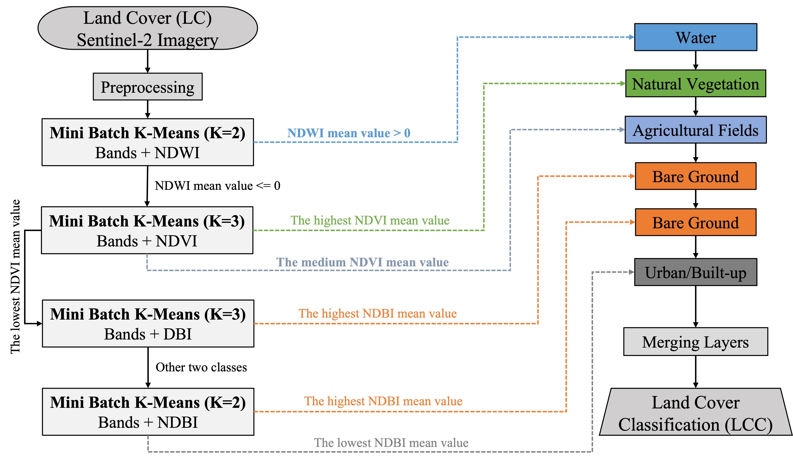
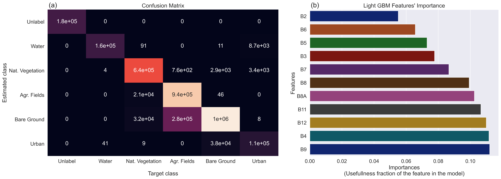

<center>
    <h1> Land Cover and Land Use Clustering</h1>
</center>

## Project overview and domain knowledge

The primary problem with automatic extraction of individual land cover areas from a single index raster is the determination of the threshold value (Gasporovic et al., 2019). Index value ranges for different land cover types fall in certain ranges and are specific to each satellite imagery scene (Lee et al., 2011). Determining thresholds for separation of individual land cover types in each satellite image is a difficult and lengthy process (Gasporovic et al., 2019).

The main goal of this project is to develop a Land Cover Classification model in a collaboration-ready manner. Basically, the model includes at least the five basic land cover types: Water, Natural Vegetation, Agricultural Fields, Bare Ground, Urban or Built-up land cover like roads and buildings. 

The remaining of the activity is structured as follows. Data engineering is performed provided dataset to explore the way this data is going to be preprocessed in order to meet the goal. Then a model is generate for Land Cover clustering or unsupervised classification. The methodology of this model is briefly documented including a short explanation of the challenges encountered and their work-around. The results over the test set are presented. Then, a baseline model to test this approach against is provided including two accuracy metrics to compare the two models. Finally, a next step plan on how this land cover model could be expanded and developed further.


<h2><br>Data and Methodology</h2>

<h3><br>Data source and Characteristics</h3>

In this coding task, we are given Sentinel-2 satellite imagery from 4 regions namely China, Europe, Permian basin, and Turkmenistan. This [dataset](https://drive.google.com/drive/folders/18kvoIxcWQAFYO16wjclRI3yuEJpWhsI0?usp=sharing) includes a training set and a validation/testing set both described as follows.
* Training set: it has 8 images per site for two sites within each of the four regions. The 8 images have been collected for different times within the year for 2021.
* Testing set: this has 8 images per site for one test site within each of the four regions.

The [dataset](https://drive.google.com/drive/folders/18kvoIxcWQAFYO16wjclRI3yuEJpWhsI0?usp=sharing) provided for this task are from Sentinel-2 satellite imagery and includes only 11 bands instead of 13 existing bands. This imagery information in terms of band characteristics are summarized in Table 1.

| Bands  | Characteristics      |
|:------ |:---------------------|
| B2     | Blue                 |
| B3     | Green                |
| B4     | Red                  |
| B5     | Vegetation Red Edge  |
| B6     | Vegetation Red Edge  |
| B7     | Vegetation Red Edge  |
| B8     | NIR                  |
| B8A    | Vegetation Red Edge  |
| B9     | Water Vapor          |
| B11    | SWIR-1               |
| B12    | SWIR-2               |

<b>Table 1:</b> Band information of Sentinel-2.

<h3><br>Data Preprocessing</h3>

[Formuala Table of Spectral Indices](https://github.com/awesome-spectral-indices/awesome-spectral-indices/blob/main/output/spectral-indices-table.csv)


<h3><br>LCC modelling</h3>

Unsupervised machine learning (ML) is becoming increasing useful in extracting a specific type of land cover. For many decades, K-Means algorithm has been one of the most used clustering algorithms, mainly because of its good time performance. However, with the increasing of the size of datasets being analyzed, K-Means is seeing its attractiveness being replaced by its variant Mini Batch K-Means, because of K-Means constraint of requiring the entire dataset in memory during its training.

Many studies including Alonso (2013), Feizollah et al. (2014), and Hicks et al. (2021) have shown that Mini Batch K-Means outperformed the K-Means clustering algorithm. In this challenge, therefore, the Mini Batch K-Means has been used to group and extract land cover types based on spectral indices and raster bands.

However, the choice of this algorithm in this is not only because of its success but also the way it works. The algorithm is well known for partitioning data into clusters or groups by assuming that the number of clusters, K, is known in advance. Therefore, given the nature of the probelem at hand, Mini Batch K-Means was used to unsupervisedly extract the land cover classes (1) Water, (2) Natural Vegetation, (3) Agricultural Fields, (4) Bare Ground and (5) Urban/Built-up from the rasters of the following spectral indices:

* normalized difference water index (NDWI).
* normalized difference vegetation index (NDVI).
* dry bareness index (DBI).
* normalized dry built-up index (NDBI).

In summary, a schematic depiction of the workflow for our Land Cover Clustering/Classification (LCC) model is presented in Fig. (1).


<table class="image" style="table-layout:fixed; width:100%; min-width:700px; max-width:1000px;">
    <tr>
        <td></td>
    </tr>
    <caption align="bottom">
        <b>Figure 1:</b> Schematic depiction of the workflow for Land Cover Clustering/Classification.
    </caption>
</table>

As shown by the workflow (Fig. 1), the LCC method is developed by first distinguishing classes that show higher contrast to the rest of the satellite scene imagery. Accordingly, the water class is first extracted from the NDWI raster; then, the Natural Vegetation and Agricultural Fields Classes are extracted from the NDVI raster, and finally, the Bare Ground class is extracted from the DBI and NDBI rasters while Urban or Built-up class is extracted from NDBI raster.

The LCC method works as follows:
1. The Water class is extracted from the (11 Bands + NDWI raster) data, using Mini Batch K-Means clustering, which splits the data into two classes. The class with the higher NDWI mean value represents water. The data is now divided into two: NDWI_water and NDWI_land which contains other land cover types (Natural Vegetation, Agricultural Fields, Bare Ground and Urban).

1. The Water class is then removed from the (11 Bands + NDVI raster) data. The data remaining is then divided into three classes by Mini Batch K-Means clustering. The highest NDVI mean value class represents the Natural Vegetation class, the middle NDVI mean value class represents the Agricultural Fields class, and the lowest NDVI mean value class represents the other land cover types (Bare Ground and Urban).

1. From the (11 Bands + DBI raster) data, Water, Natural Vegetation, Agricultural Fields are removed. The data remaining is then divided into three classes by Mini Batch K-Means clustering. The highest DBI mean value class represents the Bare Ground class while the remaining two classes represent a Urban class and a Bare Ground class whose value is close to the value for the Urban class. Hence, two new rasters are created: DBI_bareland and DBI_others.

1. Finally, the (11 Bands + NDBI raster) data which contains only the remaining Bare Ground class and Urban class is divided into two classes using Mini Batch K-Means clustering where a higher NDBI mean value represents Bare Ground and the second class represents Urban class.


<h3><br><br>Accuracy assessment</h3>

For comparison of the results, all the study sites were classified using two commonly used supervised machine-learning methods: the Random Forests and the Light Gradient Boosting Machine (GBM), both decision tree based methods. However, here, only the results and analysis from Light GBM algorithm are reported. 

<h4><br>Light Gradient Boosting Machine (GBM)</h4>

[Light GBM](https://lightgbm.readthedocs.io/en/latest/) is a fast, distributed, high-performance gradient boosting framework based on decision tree algorithm, used for ranking, classification and many other machine learning tasks. Similar to other decision tree-based algorithm such RF, it produces multiple decision trees based on a random subset of the training samples and the locations of splits within each decision tree are based on a random subset of the input features.


<h3><br>Some challenges and work-around</h3>

In this part, some relative challenges encountered during this exercice are listed.

* Approaching the problem
    * Manipulating rasters
        * Understanding and extracting bands
    * Confusion in preprocessing the data
        * Deep Learning approach vs Standard Machine approach
    * Spectral Indices
        * What is it?
        * How to calculate them?
* Assigning land cover classes
    * Using spectral indices

All these challenges were overcome through research and a brief review of literature about issues ranging from Satellite Imagery to the Land Cover Classification (LCC), but also the exchanges with Zani help to find out how to leverage spectral indices to assign groups of pixels to a land cover type.


<h3><br>How to use this LCC model (to be improved)</h3>

<br>In this section, a description is provided on how to use this Land Cover Clustering and Classification model. To start, the project directory is basically structured as follows.
```bash

```
```bash
├── data-in
│   ├── test
│   └── train
├── data-out
│   └── models
├── figures
├── README.md
├── requirements.txt
└── scripts
```
Setting up the workspace is the first and most important step while working on a project in DS/ML/AI. The workspace folder is thus the most important one to note. This is the folder where all the magic will happen. It contains four folders, one `.txt` file and one `.md` file.

* `data-in`: (in=input) the folder where the original image files live, and it has two sub-folders:
    * `train`: where the training images live.
    * `test`: where the validation imaes live.
* `data-out`: (out=output) the folder where the output will live. When the project is complete, it will include one sub-folder:
    * `models`: this folder will contain the training model files used for classification.
* `scripts`: the folder where all the project-written modules/codes live. 
* `figures`: the folder where all the visual output will live.
* `requirements.txt`: the file containing all the packages/modules required for the project.
* `README.md`: the file containing the project-background knowledge, the methodology, results, etc. That is, the file where this is happening.

After installing the main required packages (`pip install -r requirements.txt` assuming you are in the base directory), move and point to the `scripts` directory (`cd ./scripts`) run the following code in the terminal:

```bash
$ python lcc_lgbm_model_run.py
```


<h2><br><br>Results</h2>


<h3><br>Rasters of individual spectral indices</h3>

As described LCC workflow (Fig. 1), the first step after preprocessing was to create rasters of individual spectral indices. Some examples of sites of the study regions are shown in Fig. 2 as well as the associated rasters of the spectral signatures/indices NDWI, NDVI, DBI and NDBI.

We can see from Fig. 2 that water in the NDWI rasters (Figs. 2b, g, l, q) has the highest value and is very well separated from the other land cover types. It is also noticeable that vegetation is prominent in the NDVI raster (Figs. 2c, h, m, r). The next two rasters, DBI (Figs. 2d, i, n, s) and NBLI (Figs. 2e, j, o, t), show that bare ground is clearly defined.

<table class="image" style="table-layout:fixed; width:100%; min-width:700px; max-width:1010px;">
    <tr>
        <td></td>
    </tr>
    <caption align="bottom">
        <b>Figure 2:</b> Sites of the study regions as shown by y-axis labels. Panels (a, f, k, p) show the "true color image (RGB)" of these sites; and each of these panels (b-e), (g-j), (l-o), and (q-t) respectively show NDWI, NDVI, DBI and NDBI rasters. 
    </caption>
</table>


<h3><br>Land Cover Clustering (to be included)</h3>


<h3><br>Model accuracy assessment over the test set</h3>

The efficacy of our LCC model is demonstrated by carrying out experiments on the testing data. The overall and per-class classification results over the test set trained using the Light GBM model are shown in Tables 2 (for the classification report) and in Fig. (3a) for Confusion Matrix, which is a decision tool that helps to solve classification problems in supervised machine learning. This table shows a summary of the precision, recall, F1 score for each class. The reported average scores include macro average (averaging the unweighted mean per class), weighted average (averaging the support-weighted mean per class) and are computed from all classes using the Confusion Matrix (Fig. 3a). On the test set the Light GBM approach achieved an overall F1-score of about 88.75% that also represents the accuracy (Table 2) of the model.

<table class="image" style="table-layout:fixed; width:100%; min-width:700px; max-width:1010px;">
    <tr>
        <td></td>
    </tr>
    <caption align="bottom">
        <b>Figure 3:</b> Summary of the Land Cover Clustering assessment using Light GBM. Panel (a) shows the Features' Importances of the Light GBM method used to classify land cover types; and panel (b) shows the Confusion Matrix. 
    </caption>
</table><br>

| Class                 | Precision | Recall | F1-Score |
|:----------------------|:----------|:-------|:---------|
|0: Unlabel             |1.00       |1.00    |1.00      |
|1: Water               |0.9997     |0.9490  |0.9737    |
|2: Nat. Vegetation     |0.9237     |0.9890  |0.9553    |
|3: Agr. Fields         |0.7695     |0.9784  |0.8615    |
|4: Bare Ground         |0.9618     |0.7668  |0.8533    |
|5: Urban/Built-up      |0.8974     |0.7359  |0.8087    |
|accuracy               |           |        |0.8875    |
|macro avg              |0.9254     |0.9032  |0.9087    |
|weighted avg           |0.9022     |0.8875  |0.8865    |

<b>Table 2:</b> Per class (0-5) and overall results on the test set using RF.


<br>Here, is presented the Feature Importance, which is nothing but a sort of measure of the contribution of a feature or predictor in the development (training and validation) of a model. The Feature Importances of the Light GBM classifier used in this challenge is presented here in Fig. (3b). It shows that the Sentinel-2 bands (features) B4, B7, B8, B8A, B9, B11, and B12 contributed the most in this clssification with a cumulative contribution of about of 72.85%.

<h3><br>Classification Maps (in progress)</h3>

Quantitative results are very useful to compare the performance of a model across land cover types or different models, it would also be visually useful to assess the spatial classification maps of few images.


<h2><br><br>Benchmarkink and next step (in progress)</h2>


<h2><br><br>Useful References</h2><br>

[1] [Gasparovic et al. (2019)](https://doi.org/10.1016/j.compenvurbsys.2019.03.001)

[2] [Zhang et al. (2021)](https://doi.org/10.3390/app11020543)

[3] [Varon et al. (2018)](https://drive.google.com/file/d/1hibiweI-2NqG5b-8PryCYTsnGOWrCVDg/view?usp=sharing)

[4] [Ehret et al. (2021)](https://drive.google.com/file/d/1dZr9oIbV7aA7lUozYDCKSFn2q72QAcT8/view?usp=sharing)


